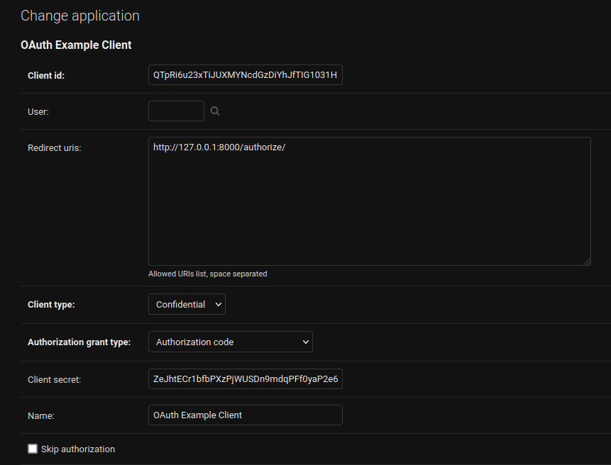

# A (mild) Django API which integrates with the Tutor / Open edX Platform

## Purpose

This repository is intended as a proof of concept reponse to the "Open edX"
task of the IBL Platform Test IV coding challenge. Many of the decisions made
for this project were based on finding a minimal viable product (MVP) which
favors expedience over robustness. This is not intended to be a production ready
solution, but rather a demonstration of the author's ability to quickly
implement a solution to a problem.

## Approach & Installation

1. This project requires Python and Poetry. [Install](https://python-poetry.org/docs/#installation) Poetry.
2. [Initialize](https://python-poetry.org/docs/basic-usage/#initialising-a-pre-existing-project) the project with Poetry.
3. Run [tutor](https://docs.tutor.overhang.io/install.html). I setup the platform with `tutor local launch` & ran everything with `local`.
   - I named my platform `openedx.temp.com`.
   - I followed the "Usage" steps [here](https://gallery.ecr.aws/ibleducation/ibl-edx-ce) for use with the ibl platform.
   - I setup a super user with `tutor local createuser --staff --superuser --username admin --email admin@example.com`. All django users/passwords are `admin/admin` in this project for simplicity.
4. Register the app. I chose to register a new application with the following information: 
5. I used [this guide](https://opencraft.com/use-the-open-edx-lms-for-authentication/). Navigate to the `identifier/profiles/oauth.py` & replace the client id and client secret with that generated in the previous step.
6. To setup Django with Authlib to access LMS. Run the following :

    ```shell
    $ cd identifier
    $ ./manage.py migrate
    $ ./manage.py runserver
    Watching for file changes with StatReloader
    Performing system checks...

    System check identified no issues (0 silenced).
    August 15, 2023 - 23:53:35
    Django version 4.1.10, using settings 'identifier.settings'
    Starting development server at http://127.0.0.1:8000/
    Quit the server with CONTROL-C.
    ```

7. Authorize by navigating to `http://localhost:8000/`. This step should redirect to the login. Use the superuser login that you created in step 3. The result should display information (as json) about the user and "access_token". Keep this token. If you need to get a new access token, navgiate back to `http://localhost:8000/` again to regenerate the token.
8. With Postman or curl, perform a GET at `http://localhost:8000/greeting/?text=foo`. The authorization should use OAuth2 to authorize with the access token from the previous step. Try a few different text values.
9. [Create](https://www.educative.io/answers/how-to-create-a-superuser-in-django) another superuser in the local django admin.
10. Use the login from step 9 to login to the local Django admin. Note that the "Greeting" is logged to the django admin.

## Notes

- I chose not to integrate with the LMS for logging the "Greeting" model, though I could and this choice was made due to the necessity of expediency. I have just enough experience with Django to know that I could do this, but not enough to know how to do it quickly. I would use [this](https://blog.lawrencemcdaniel.com/getting-started-with-open-edx-plugin-architecture/) and [this](https://github.com/cookiecutter-openedx/openedx-plugin-example/tree/main/openedx_plugin_api) as a guide for a plugin to demonstrate something like this. I would also try to incorporate the cookiecutter [project](https://github.com/openedx/edx-cookiecutters/blob/master/README.rst).  
